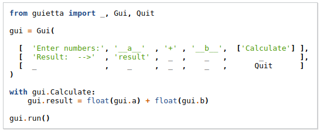
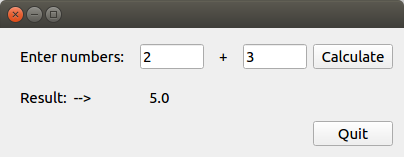
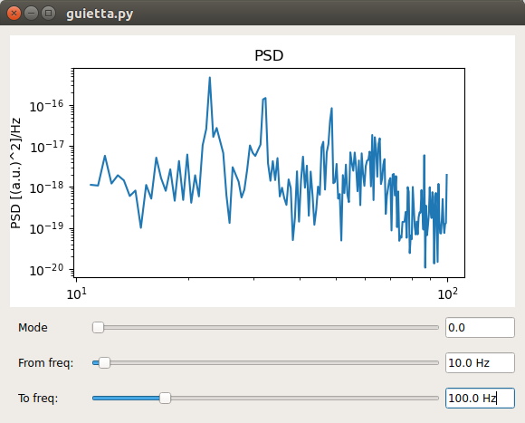

Guietta!
========

Guietta is a tool that makes simple GUIs *simple*:

And here it is:

Also featuring:
 - matplotlib integration, for easy event-driven plots
 - easily display columns of data in labels using lists and dicts
 - multiple windows
 - customizable behaviour in case of exceptions
 - queue-like mode (a la PySimpleGUI)
 - integrate any QT widget seamlessly, even your custom ones (as long as
   it derives from QWidget, it is OK)
 - easy background processing for long-running operations
 - ordinary QT signals/slots, accepting any Python callable, if you really
   want to use them
 
Installation
============

 **pip install guietta**

Source code
===========

https://github.com/alfiopuglisi/guietta

Screenshots
===========

Guietta at work in a scientific lab, showing an interactive plot.

Troubleshooting
===============

Guietta uses Qt5, and some Linux distributions, like Ubuntu 16.04, appear
to have an incomplete default installation. If you encounter trouble
running guietta, please read the
`troubleshooting guide <troubleshooting.html>`_.

If you use conda, please read our page on
`QT incompatibilities with conda <qt_conda.html>`_.

Documentation
=============

.. toctree::
   :maxdepth: 1

   intro
   tutorial
   reference
   internals

